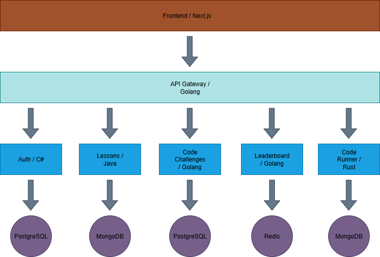

# LearnLang 🧠 Microservices Architecture – Code Learning Platform
LearnLang is a polyglot microservices-based platform designed to help users learn programming languages in a structured, scalable, and engaging way. Built with performance in mind and deployed entirely on free-tier infrastructure, LearnLang delivers interactive lessons, real-time code challenges, and visual code snippets—all without unnecessary complexity.

---

## 🗺️ Architecture Diagram



## 📐 Architecture Overview

This system is composed of the following components:

- **Frontend**: Next.js (React)
- **API Gateway**: Golang
- **Microservices**:
  - Auth (C#)
  - Lessons (Java)
  - Code Challenges (Golang)
  - Leaderboard (Golang)
  - Code Runner (Rust)
- **Databases**:
  - PostgreSQL
  - MongoDB
  - Redis

Each service is independently deployable and communicates via REST APIs and webhooks.

---

## 🧰 Technology & Framework Choices

### 🌐 API Gateway – Golang

- **Purpose**: Central routing, authentication, rate limiting, and logging.
- **Why Go**: High concurrency, low memory footprint, compiled binaries, and consistent with other backend services.

### 🔐 Auth Service – C#

- **Purpose**: User registration, login, and JWT token management.
- **Why C#**: Strong type safety, ASP.NET Core identity features, and integration with Azure.

### 📚 Lessons Service – Java

- **Purpose**: Serve educational content and track user progress.
- **Why Java**: Mature ecosystem, robust threading, and flexible REST API support.

### 🧠 Code Challenges Service – Golang

- **Purpose**: Manage coding problems and validate submissions.
- **Why Go**: Fast execution, great concurrency, and lightweight deployment.

### 🏆 Leaderboard Service – Golang

- **Purpose**: Track and serve user rankings.
- **Why Go**: Real-time updates, efficient score processing, and Redis integration.

### ⚙️ Code Runner Service – Rust

- **Purpose**: Securely compile and execute user-submitted code.
- **Why Rust**: Memory safety, performance, and ideal for sandboxed environments.

---

## 🗄️ Database Choices

| Service         | Database   | Reason for Choice                          |
| --------------- | ---------- | ------------------------------------------ |
| Auth            | PostgreSQL | Strong consistency and relational schema   |
| Lessons         | MongoDB    | Flexible schema for varied content types   |
| Code Challenges | PostgreSQL | Structured challenge data                  |
| Leaderboard     | Redis      | Fast in-memory access for rankings         |
| Code Runner     | MongoDB    | Store logs and unstructured execution data |

---

## 🐳 Docker Strategy

This project avoids Docker in early stages to simplify deployment and stay within free-tier limits. Most services are deployed using platform-native build pipelines (e.g., Vercel, Azure App Service, Fly.io, Railway).

Docker may be introduced later for:

- Local development consistency
- CI/CD container builds
- Migration to Kubernetes or service mesh

For now, simplicity and speed take priority.

## 🚀 Deployment Strategy (Free-Tier Friendly)

---

| Component       | Platform          | Notes                                         |
| --------------- | ----------------- | --------------------------------------------- |
| Frontend        | Vercel            | Native Next.js support, CI/CD, custom domains |
| API Gateway     | Fly.io / Railway  | Lightweight Go binary, global deployment      |
| Auth (C#)       | Azure App Service | Free tier for .NET apps                       |
| Lessons (Java)  | Render / Glitch   | Java support, free tier with 512MB RAM        |
| Code Challenges | Fly.io / Railway  | Go-friendly, webhook support                  |
| Leaderboard     | Same as above     | Redis integration                             |
| Code Runner     | Fly.io / Oracle   | Rust binaries, containerized execution        |
| PostgreSQL      | Supabase / Neon   | Free tier with REST API and auth              |
| MongoDB         | MongoDB Atlas     | 512MB shared cluster                          |
| Redis           | Upstash           | Serverless Redis, Pub/Sub support             |

---

## 🔗 Communication Strategy

- **Webhooks**: Used for asynchronous communication between services (e.g., Code Runner → Code Challenges → Leaderboard).
- **REST APIs**: Used for synchronous data exchange and frontend integration.
- **JWT Tokens**: Used for authentication across services.

---

## 🖼️ Code Snippet Images – Cloudinary Integration

To visually enhance lessons with styled code snippets (similar to Codecademy), this project uses **Cloudinary** to store and serve images.

### ✅ Why Cloudinary?

- **Free-tier friendly**: Easily supports hundreds of WebP images with generous bandwidth and transformation credits.
- **Automatic optimization**: Converts PNGs or JPEGs to WebP using URL parameters (`f_auto`, `q_auto`) for faster loading.
- **CDN-backed delivery**: Ensures fast, global access to lesson assets.
- **No manual conversion needed**: Upload PNGs from tools like Carbon, serve as WebP instantly.

### 🧠 Usage Strategy

- Code snippet images are generated using [Carbon](https://carbon.now.sh/) or similar tools.
- Images are uploaded to Cloudinary and served via optimized URLs.
- Example:
  ```html
  /image/upload/f_auto,q_auto/code-snippet.png"
    alt="Code Snippet"
  />
  ```

---

## 🧑‍💻 Author

Built by João in Porto, Portugal 🇵🇹  
Modular, scalable, and open to contributions.
